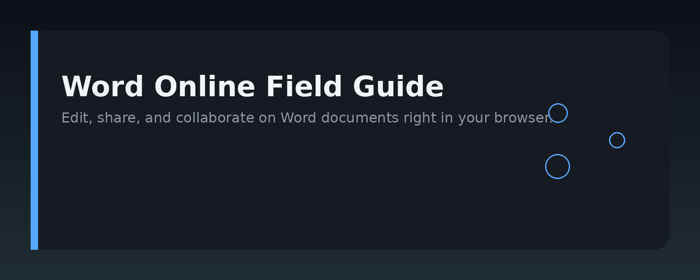
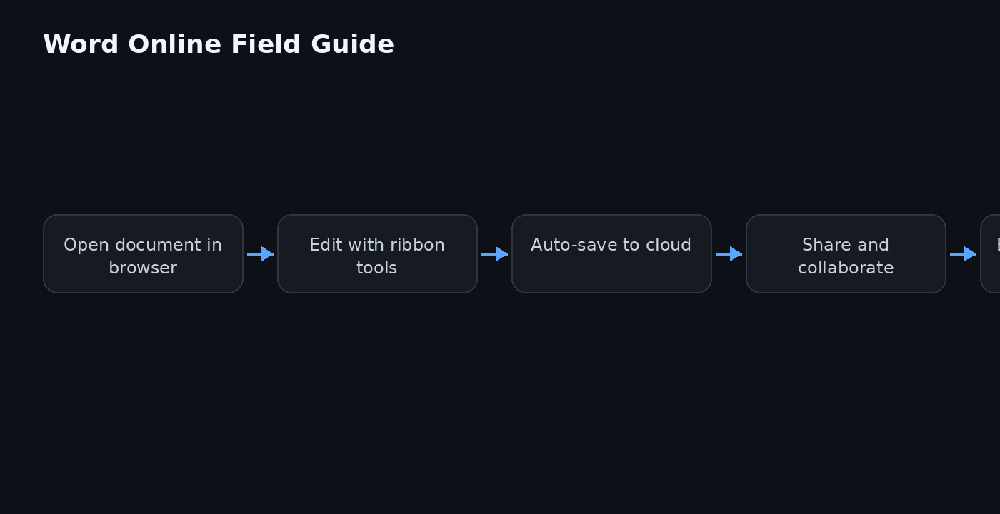

# Microsoft Word Online: The Practical Guide




## Overview

Microsoft Word Online is the browser-based edition of Microsoft Word, part of the Microsoft 365 suite. It lets you create, edit, and share `.docx` documents without installing desktop software. This repository is a practical, code-adjacent reference for developers, technical writers, and power users who want to automate or integrate with Word Online.

The guide covers the core editing model, the file format it reads and writes, and how to build workflows around it using Office JavaScript APIs, SharePoint, and Microsoft Graph. It is not an official Microsoft documentation mirror—it is a distilled, hands-on companion for real projects.

## Why it exists

Word Online solves a specific set of problems that the desktop app does not:

- **Zero-install editing** – open a document from any modern browser on any OS.
- **Real-time co-authoring** – multiple people edit the same file simultaneously with presence indicators and version history.
- **Tight SharePoint/OneDrive integration** – documents live in cloud storage, so permissions and sharing are handled at the platform level.
- **Embeddable editor** – you can drop Word Online into your own web app via the Office Online embed feature.

For developers, the pain point is that Word Online is not just "Word in a browser." It has a different API surface, different permission model, and different automation limits. This repo exists to close that gap with concrete examples.

## Core concepts

- **Document (.docx)** – the Open XML file format. Word Online reads and writes this format natively, preserving most features from the desktop app.
- **Co-authoring session** – when two or more users open the same file, Word Online creates a shared session. Changes sync via the service, not via file locks.
- **Office JS API** – the JavaScript API for add-ins that run inside Word Online. It lets you read and modify document content, insert text, and respond to selection changes.
- **Add-in manifest** – an XML file that describes your add-in's entry points and permissions. It is required for any custom functionality.
- **Microsoft Graph** – the REST API for accessing files stored in OneDrive or SharePoint. You can list, download, upload, and convert documents programmatically.
- **Embed URL** – a special URL that renders a read-only or editable view of a document inside an `<iframe>`.

## Architecture

The diagram above shows the high-level flow. Here is the breakdown:

1. **Client browser** loads the Word Online web app.
2. The app talks to the **Microsoft 365 backend** over HTTPS, which handles document storage, auth, and co-authoring state.
3. **Add-ins** run in a sandboxed iframe inside the Word Online page. They communicate with the document via the Office JS API bridge.
4. **External automation** (your server or script) uses **Microsoft Graph** to interact with the same files, independent of any open editing session.

```
Browser (Word Online UI)
       |
       | Office JS API (in-page add-ins)
       v
Microsoft 365 Backend (auth, storage, co-authoring)
       ^
       | Microsoft Graph REST API
       |
External service / script
```

The key architectural rule: never assume a file is not being edited. Always use optimistic concurrency (e.g., `eTag` headers) when writing via Graph.

## Practical workflow

A typical automation workflow for Word Online documents looks like this:

1. **Acquire a token** – use the OAuth 2.0 client credentials flow (app-only) or delegated flow (user context).
2. **Locate the file** – call `GET /me/drive/root:/path/to/file.docx` or use a SharePoint drive ID.
3. **Read content** – either download the raw `.docx` and parse it, or use the Word Online embed URL for a UI view.
4. **Edit** – choose between:
   - **Add-in (in-browser)** – for user-driven edits inside the editor.
   - **Graph upload** – for programmatic replacement of the file.
   - **Office JS from a custom web app** – if you embed the editor yourself.
5. **Handle conflicts** – check the `eTag` before overwriting; if it changed, re-fetch and merge.

## Examples

### 1. Embed Word Online in an iframe (read-only)

```html
<iframe
  src="https://office.com/webapps/word/embed/viewer?src=https%3A%2F%2Fyourtenant.sharepoint.com%2F...%2Fdocument.docx"
  width="100%"
  height="600px"
  frameborder="0"
></iframe>
```

Replace the `src` parameter with the URL-encoded direct link to your `.docx` file.

### 2. List recent Word documents via Microsoft Graph

```python
import requests

def list_word_docs(access_token):
    headers = {"Authorization": f"Bearer {access_token}"}
    url = "https://graph.microsoft.com/v1.0/me/drive/root/search(q='.docx')"
    resp = requests.get(url, headers=headers)
    resp.raise_for_status()
    return [item["name"] for item in resp.json()["value"]]
```

### 3. Insert text into the active document with an Office add-in

```javascript
// Inside an Office Word add-in
Office.onReady(() => {
  Word.run(async (context) => {
    const doc = context.document;
    const body = doc.body;
    body.insertText("Inserted from an add-in.\n", Word.InsertLocation.end);
    await context.sync();
  });
});
```

### 4. Upload a new version of a document via Graph

```bash
curl -X PUT \
  "https://graph.microsoft.com/v1.0/me/drive/items/{ITEM_ID}/content" \
  -H "Authorization: Bearer $TOKEN" \
  -H "Content-Type: application/octet-stream" \
  --data-binary @updated.docx
```

Include the `If-Match` header with the current `eTag` to avoid overwriting a concurrent edit.

## FAQ

**Q: Can Word Online open `.doc` files?**  
Yes, it converts them to `.docx` on open. The conversion happens in the background and the original file is not modified unless you save a copy.

**Q: Does Word Online support macros (VBA)?**  
No. Word Online does not run VBA macros. Use Office JS add-ins instead for automation inside the editor.

**Q: What is the difference between the embed URL and the Graph API for editing?**  
The embed URL gives you an interactive UI in an iframe. The Graph API lets you read/write the file bytes programmatically. They are complementary, not interchangeable.

**Q: How do I handle co-authoring conflicts in my own code?**  
When writing via Graph, always send the `If-Match` header with the current `eTag`. If the request fails with a 412 Precondition Failed, the file changed since you read it—re-fetch and merge.

**Q: Can I use Word Online offline?**  
No. It requires a network connection. For offline editing, use the desktop app or the mobile app with offline sync enabled.

## License

MIT

Topic: `word-online-document-editing`
